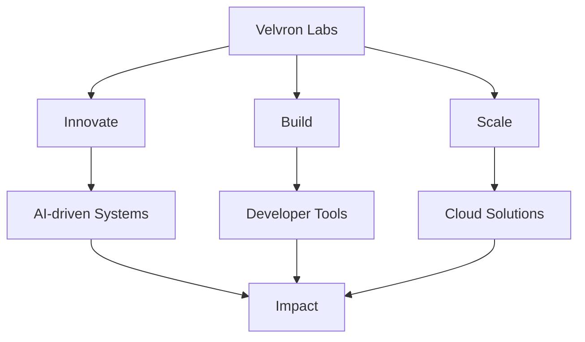

# 🚀 Velvron Labs

  <b>Engineering the Future, One Line of Code at a Time</b>

  <a href="https://velvronlabs.vercel.app">🌐 Website</a> • <a href="mailto:brownnestro0@gmail.com">📧 Email</a> • <a href="https://www.linkedin.com/in/nestro-brown-0b2734361/">💼 LinkedIn</a>

---

## 📚 Table of Contents
1. [About Us](#about-us)
2. [Vision & Mission](#vision--mission)
3. [What We’re Working On](#what-were-working-on)
4. [Contact](#contact)

---

## 🏢 About Us

Velvron Labs is more than just a company — it’s a mindset. We focus on:

- **Innovation-First Engineering** — pushing boundaries of AI, cloud, and automation
- **Scalable Solutions** — building tech that grows as you grow
- **Purpose-Driven Design** — creating tools that matter

> Founded in **2025**, we’re small but mighty — and ready to shake things up.

---

## 📈 Vision & Mission

> **Turn ambitious ideas into transformative products.**

---

## 🛠️ What We’re Working On

- 🤖 AI research & prototyping
- ☁️ High-performance cloud architectures
- 🛠️ Sleek, developer-friendly tools
- 🧪 Experimental open-source frameworks

---

## 📬 Contact

For partnerships, licensing, or collaboration:

| Method   | Details |
|----------|---------|
| 📧 Email | [brownnestro0@gmail.com](mailto:brownnestro0@gmail.com) |
| 🌐 Website | [velvronlabs.vercel.app](https://velvronlabs.vercel.app) |
| 💼 LinkedIn | [Nestro Brown](https://www.linkedin.com/in/nestro-brown-0b2734361/) |

---

  © 2025 Velvron Labs. All rights reserved.

