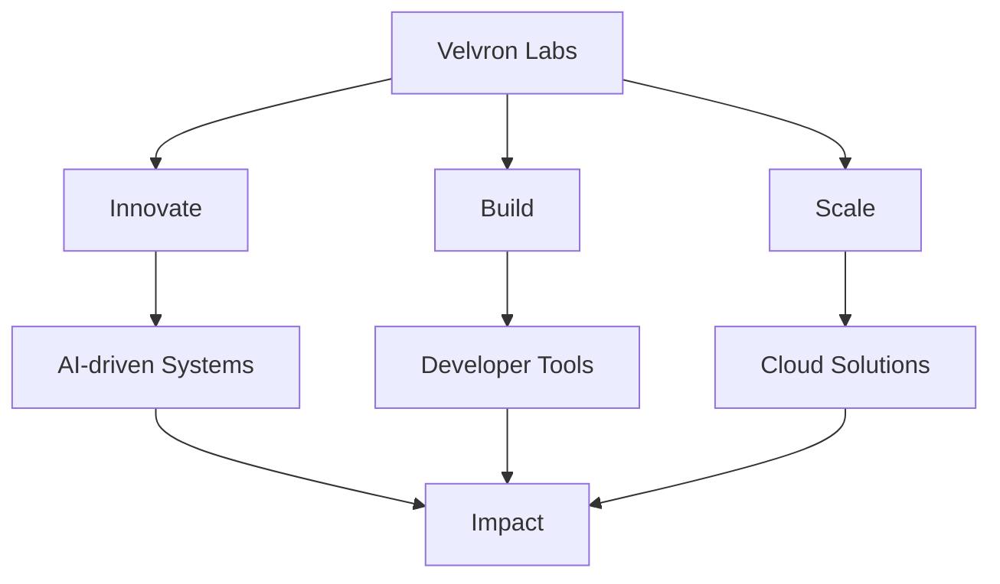

# 🚀 Velvron Labs

> *Engineering the Future, One Line of Code at a Time*

Welcome to **Velvron Labs** — an independent tech startup founded and led by **[Your Name]**, current CEO, founder, and solo member.  
Our mission? Build cutting-edge, impactful technology that bridges creativity, scalability, and real-world problem-solving.

---

## 🏢 About Us

Velvron Labs is more than just a company — it’s a mindset. We focus on:
- **Innovation-First Engineering** – pushing boundaries of AI, cloud, and automation.
- **Scalable Solutions** – building tech that grows as you grow.
- **Purpose-Driven Design** – creating tools that matter.

Founded in **[Year]**, we’re small but mighty — and ready to shake things up.

---

## 📈 Vision & Mission

---

Our mission:  
> **Turn ambitious ideas into transformative products.**

---

## 🛠️ What We’re Working On
- AI research & prototyping
- High-performance cloud architectures
- Sleek, developer-friendly tools
- Experimental open-source frameworks

---

## 📬 Contact

For partnerships, licensing, or collaboration:
- **Email:** brownnestro0@gmail.com
- **Website:** velvronlabs.vercel.app
- **LinkedIn:** https://www.linkedin.com/in/nestro-brown-0b2734361/

---

© 2025 Velvron Labs. All rights reserved.
